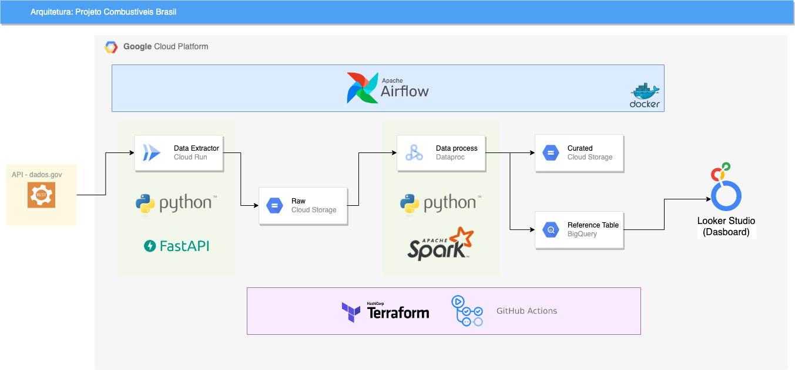
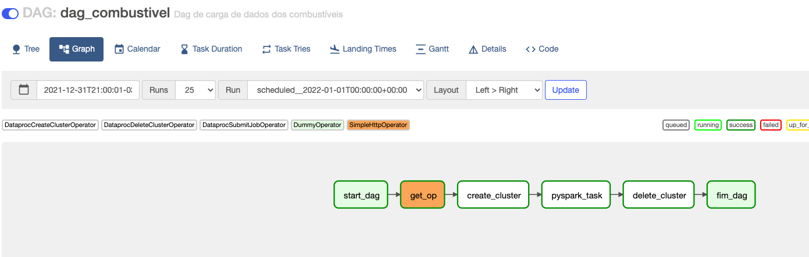

# Google Cloud Platform - ETL

The objective of this project was to create a data pipeline to extract information from a public database about fuel prices in Brazil.

- **Data source:**
  - Website: https://dados.gov.br/dataset/serie-historica-de-precos-de-combustiveis-por-revenda
  - Metadata: https://www.gov.br/anp/pt-br/centrais-de-conteudo/dados-abertos/arquivos/shpc/metadados-serie-historica-precos-combustiveis.pdf

For this project, the following technologies were used:

- **Terraform**: To create project resources;
- **Github Actions**: To create a CI/CD mat to do the automated deployment of project resources, helping Terraform;
- **Airflow**: To carry out the task of orchestrating the pipeline;
- **Google Cloud Storage:** For storing Raw and Cured data;
- **Big Query:** For curated data storage;
- **Looker Studio (formerly Data Studio):** For creating the Dashboard;
- **Google Cloud Dataproc:** For data processing with Spark;
- **Google Cloud Run:** To host the API that collects Fuel data;

The components were organized in the following architecture:

For Airflow, we used a docker image that is in the /airflow directory. However, to upload the service locally, just run the **make** command from the root directory.

The image below illustrates the DAG created for the orchestration. There are two dummy operators at start and end for organization purposes. The get_op task is responsible for making the API call present in Cloud Run and thus extracting the data from the source. Next, the create_cluster task creates a dataproc cluster to perform data processing with Spark. The next task runs the processing job within the newly created cluster and finally the cluster removal is performed.

The API was made using the FastAPI framework and is present in the /api directory. To deploy this application on Cloud Run, just run the shell script present in the same folder. For the deployment to actually take place, you must be logged into your Google Cloud Platform account through the SDK. If you haven't installed it yet, just access this [link](https://cloud.google.com/sdk/docs/install-sdk).

The pipeline in PySpark followed the following steps:

The main function takes as a parameter:
- path_input: Path of the GCS data generated by the collector API. Ex: gs://bucket_name/file_name.
- path_output: Path where processed data will be saved. Ex: gs://bucket_name_2/file_name.
- format_file_save: File format to be saved in path_output. For example: PARQUET.
- dataset: Dataset in BigQuery where the table is.
- table_bq: BigQuery table where the data will be saved. Ex: dataset.table_example

As for data transformation, the following steps were performed:

1. Read the data according to the informed path_input
2. Rename the file columns, respecting BigQuery standards
3. Add a Year column, based on the `Collection Date` column
4. Add a Semester column, based on the `Collection Date` column
5. Add a Filename column. Tip: pyspark.sql.functions.input_file_name
6. Parse the data read according to the table in BigQuery
7. Write the data in the Bucket GCS, in the informed path `path_output`
in the format specified in the `format_file_save` attribute.
8. Write data to BigQuery according to the table specified in the `table_bq` attribute.

Finally, a dashboard was developed using GCP's Looker Studio tool. For this, on the home page of Looker Studio, the creation of a blank report was selected and then the dashboard was connected to the table in BigQuery where the extracted data was sent.